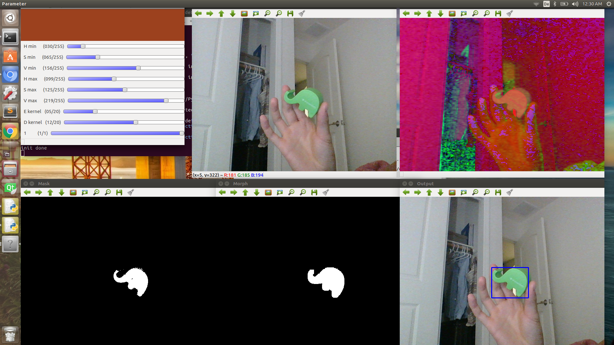

# opencv_color_object_detection
Python Code to detect a colored object

# Dependencies:
OpenCV 3.2.0
Python 2.7
Numpy Library

# Workflow:
  1. Create Trackbar to adjust parameters                 (Top left image)
  2. Capture current image                                (Top center image)
  3. Convert BGR image into HSV image                     (Top right image)
  4. Filter the HSV image with upper and lower HSV values (Bottom left image)
  5. Erode and dilate white pixels                        (Bottom center image)
  6. Find contours and fit rectangle around detection     (Bottom right image)

# Example:

# Alternative
A C++ solution can be found here: https://www.youtube.com/watch?v=bSeFrPrqZ2A
